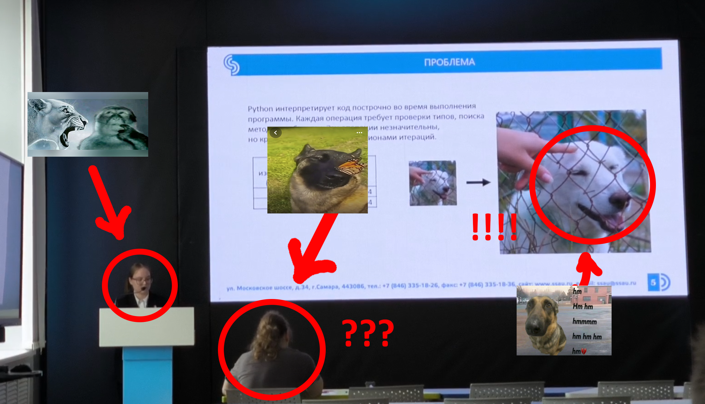
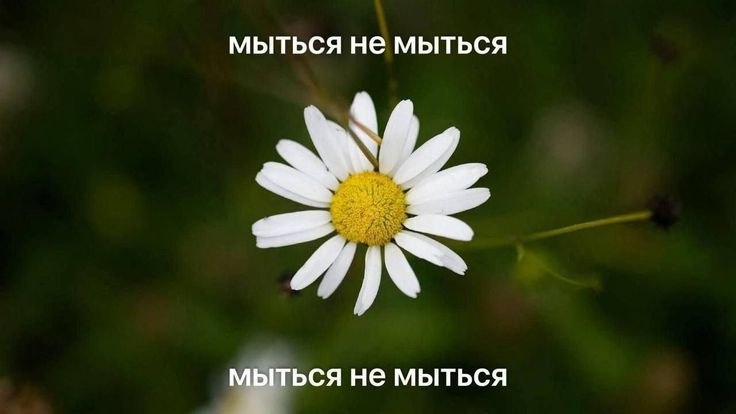

# Лабораторная работа №1 
**ФИО**: Лепаловская Арина Ивановна\
**Группа**: 6403-010302D 

**Научный руководитель**: ГОШИН ЕГОР ВЯЧЕСЛАВОВИЧ\
**Тема диплома**: Исследование метода разреженных представлений в задачах обработки изображений

**Я и мой научник**: 

**Любимая цитата**: 
>А вы о ком подумали, товарищ Берия?

**Любимая картинка**: 

---
**Вступайте в СНО ИИК:** https://t.me/snoiic